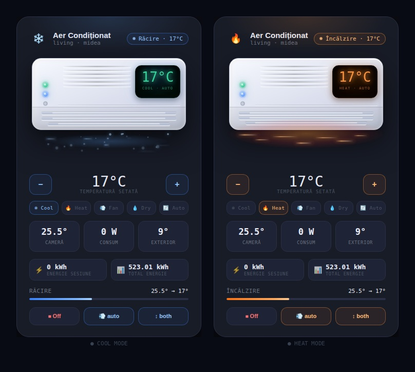

# AC Climate Card

A custom Lovelace card for Home Assistant that gives your AC unit a proper visual interface — animated unit illustration, per-mode color themes, live sensor data, and full climate controls, all from a single entity ID.



---

## What it shows

- Animated AC unit with airflow, mist particles, and mode-specific effects (orange glow pulse for heat, cool mist for cooling)
- Live data pulled automatically: room temperature, outdoor temperature, power draw, session energy, total energy
- Full controls: temperature up/down, HVAC mode selector, fan mode cycle, swing cycle, on/off toggle
- Color theme shifts per mode — blue for cool, orange for heat, purple for fan, cyan for dry, green for auto

---

## Installation

### Via HACS (recommended)

1. Open HACS → **Frontend**
2. Click the three dots in the top right → **Custom repositories**
3. Paste your repo URL, set category to **Lovelace**, click **Add**
4. Find **AC Climate Card** in the list and click **Download**
5. Add the resource to Home Assistant:

   **Option A — UI:**  
   Settings → Dashboards → three dots → **Resources** → Add resource  
   URL: `/hacsfiles/ac-climate-card/ac-climate-card.js`  
   Type: `JavaScript module`

   **Option B — YAML:**  
   ```yaml
   lovelace:
     resources:
       - url: /hacsfiles/ac-climate-card/ac-climate-card.js
         type: module
   ```

6. Reload your browser (hard refresh: `Ctrl+Shift+R`)

---

### Manual installation

1. Download `ac-climate-card.js` from the latest [release](../../releases/latest)
2. Copy it to `config/www/ac-climate-card/ac-climate-card.js`
3. Add resource:  
   URL: `/local/ac-climate-card/ac-climate-card.js`  
   Type: `JavaScript module`
4. Reload browser

---

## Usage

Add to any dashboard in YAML mode:

```yaml
type: custom:ac-climate-card
entity: climate.midea_ac_152832116516967
```

That's it. The card finds all associated sensors on its own.

### Optional config

```yaml
type: custom:ac-climate-card
entity: climate.midea_ac_152832116516967
name: Aer Condiționat     # overrides the default friendly_name
area: living room          # shown as subtitle under the name
```

---

## Auto-discovery

Give the card your `climate.*` entity and it will automatically look for the following sensors based on the entity prefix:

| Displayed as | Entity ID pattern |
|---|---|
| Room temp | `sensor.{prefix}_temperatura_interioara` |
| Outdoor temp | `sensor.{prefix}_temperatura_exterioara` |
| Power draw | `sensor.{prefix}_power` |
| Session energy | `sensor.{prefix}_current_energy` |
| Total energy | `sensor.{prefix}_total_energy` |

If a sensor doesn't exist or is unavailable, that field just shows `--` — no errors, no crashes.

---

## Compatibility

Works with any `climate` entity that exposes standard HA attributes (`hvac_mode`, `temperature`, `current_temperature`, `fan_mode`, `swing_mode`). Tested with **Midea AC** via the `midea-ac-py` integration. Should work with any other brand that uses the same entity naming pattern.

---

## Requirements

- Home Assistant 2023.x or newer
- HACS (for the managed install path)

---

## License

MIT
